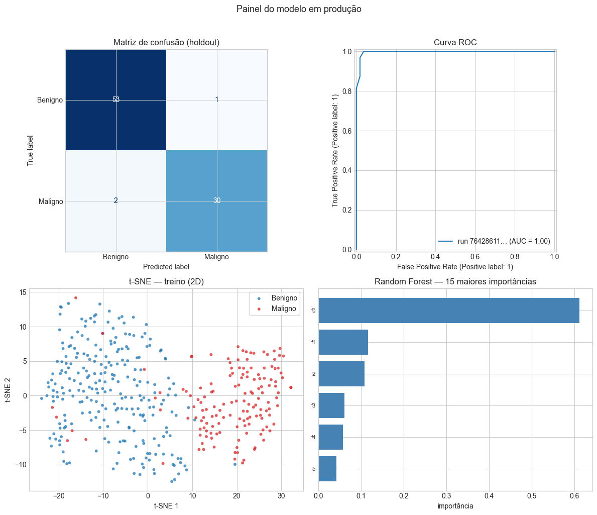
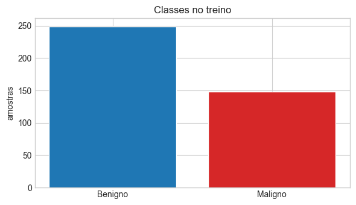

<p align="center">
  
</p>

<h1 align="center">Operacionalização de modelos com MLOps</h1>

<p align="center">
  Projeto da disciplina <strong>Fundamentos de Machine Learning com scikit-learn</strong> — visão de engenharia: pipelines reprodutíveis, MLflow, inferência e monitoramento.
</p>

<p align="center">
  <a href="https://github.com/ubyss/Infnet-Operacionalizacao-de-modelos-com-MLOps">Repositório no GitHub</a>
</p>

---

## Sobre o projeto

Classificação binária (benigno / maligno) no contexto de **câncer de mama**, com:

- ingestão e perfil de dados (`breast_cancer_mlops/data_prep.py`);
- experimentos comparativos **Random Forest** com `StandardScaler`, **PCA** e **LDA**, validação cruzada e `GridSearchCV` dentro de `Pipeline` (`breast_cancer_mlops/train.py`);
- registro no **MLflow** (parâmetros, métricas, modelo);
- exploração **t-SNE** (`breast_cancer_mlops/tsne_explore.py`);
- avaliação em holdout (`breast_cancer_mlops/evaluate.py`);
- **API** FastAPI e **interface** Streamlit (`breast_cancer_mlops/serve.py`, `breast_cancer_mlops/streamlit_app.py`);
- testes de smoke e **CI** (GitHub Actions).

Na **raiz** existem atalhos (`data_prep.py`, `train.py`, etc.) que apenas chamam os módulos do pacote — assim continuam válidos `python train.py` e `streamlit run streamlit_app.py`.

O relatório técnico está em [`RELATORIO_TECNICO.md`](RELATORIO_TECNICO.md). O notebook [`projeto_mlops_breast_cancer.ipynb`](projeto_mlops_breast_cancer.ipynb) orquestra o fluxo e importa `breast_cancer_mlops`.

## Visualizações (notebook — seção 6.1)

<p align="center">
  <br>
  <em>Painel do modelo em produção (holdout + t-SNE + importâncias)</em>
</p>

<p align="center">
  <br>
  <em>Distribuição de classes no conjunto de treino</em>
</p>

## Requisitos

- Python 3.10+ (recomendado 3.11)
- Dependências em [`requirements.txt`](requirements.txt)

## Instalação

```bash
git clone https://github.com/ubyss/Infnet-Operacionalizacao-de-modelos-com-MLOps.git
cd Infnet-Operacionalizacao-de-modelos-com-MLOps
python -m venv .venv
.venv\Scripts\activate
pip install -r requirements.txt
```

## Uso rápido

Na raiz do repositório (atalhos):

```bash
python data_prep.py
python train.py
python evaluate.py
python tsne_explore.py
```

Ou módulos explícitos:

```bash
python -m breast_cancer_mlops.data_prep
python -m breast_cancer_mlops.train
python -m breast_cancer_mlops.evaluate
python -m breast_cancer_mlops.tsne_explore
```

Interface web:

```bash
streamlit run streamlit_app.py
uvicorn serve:app --host 127.0.0.1 --port 8000
```

Explorar experimentos:

```bash
mlflow ui
```

Testes:

```bash
pytest tests -q
```

## Estrutura do repositório

```
├── breast_cancer_mlops/     # Pacote com a lógica
│   ├── paths.py             # Raiz do repositório (artifacts/, mlruns/)
│   ├── data_prep.py
│   ├── train.py
│   ├── evaluate.py
│   ├── model_io.py
│   ├── tsne_explore.py
│   ├── serve.py
│   └── streamlit_app.py
├── docs/img/                # Logo e figuras do README
├── tests/
├── projeto_mlops_breast_cancer.ipynb
├── data_prep.py             # Atalho → breast_cancer_mlops.data_prep
├── train.py
├── evaluate.py
├── tsne_explore.py
├── serve.py
├── streamlit_app.py
├── RELATORIO_TECNICO.md
├── requirements.txt
└── .github/workflows/ci.yml
```

Artefatos gerados localmente (`artifacts/`, `mlruns/`) não são versionados.

## Scripts na raiz × pacote

| Raiz (atalho) | Implementação |
|---------------|----------------|
| `data_prep.py` | `breast_cancer_mlops.data_prep` |
| `train.py` | `breast_cancer_mlops.train` |
| `evaluate.py` | `breast_cancer_mlops.evaluate` |
| `tsne_explore.py` | `breast_cancer_mlops.tsne_explore` |
| `serve.py` | reexporta `app` e `main` do pacote |
| `streamlit_app.py` | importa o módulo Streamlit do pacote |

`model_io.py` existe apenas **dentro** do pacote (carregamento do modelo); não há script isolado na raiz.

## Dados

Fontes suportadas: CSV local, variável de ambiente `BREAST_CANCER_CSV`, pasta `data/`, Kaggle via `kagglehub` ou fallback `sklearn.datasets`. Após o primeiro `data_prep`, artefatos ficam em `artifacts/` (gerados localmente).

## Licença e instituição

Material acadêmico — **Instituto Infnet**. Uso do repositório conforme política da disciplina e da instituição.
